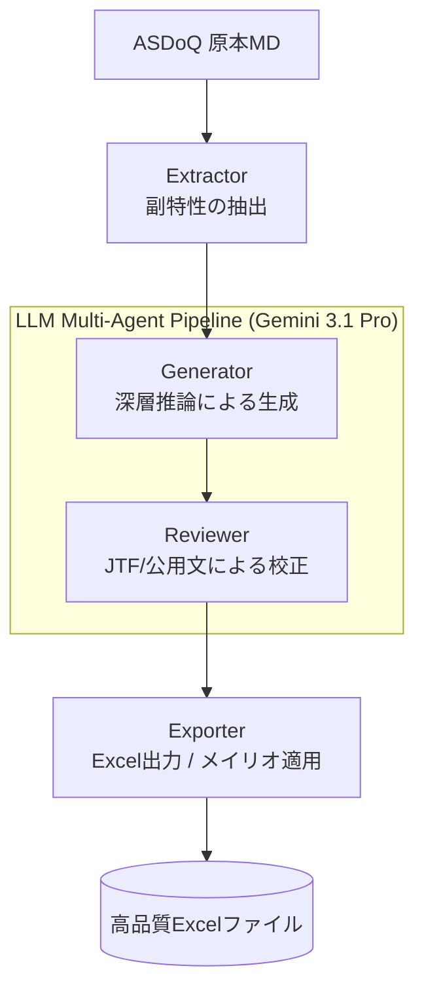
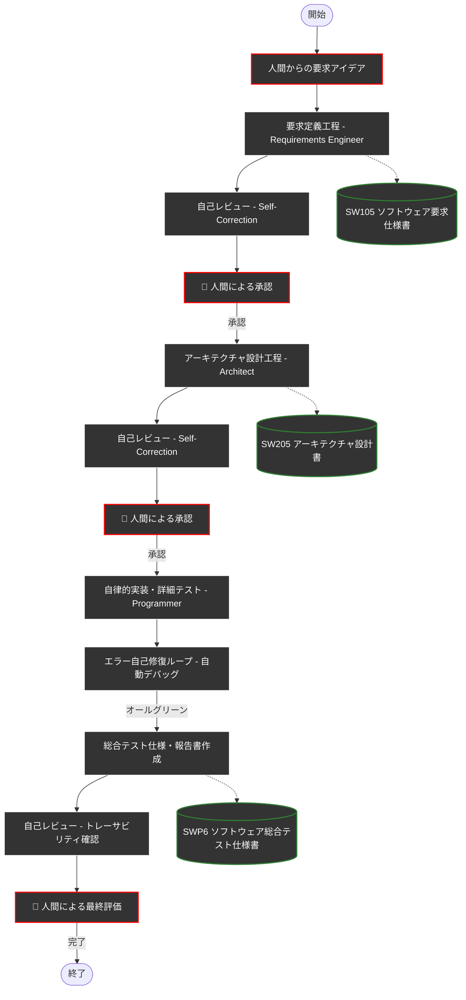

# ASDoQ 品質モデル再構成ツール (RecoModel2ndChara) 🤖📊

本リポジトリは、ASDoQ（システム開発文書品質研究会）が定義する「文書品質モデル v2.0a-3」の全17個の品質副特性を、最新のLLM **「Gemini 3.1 Pro (preview-customtools)」** を用いて高品質な実務用Excelファイルへと自動的に再構成するマルチエージェント・システムです。
最新のプロンプトエンジニアリング（マスターピース版）の導入により、単なる言い換えを超えた「深層推論」に基づく高品質な測定基準を生成します。


### プロジェクトについて
- **名前の由来**: 「副特性別の再構成モデル」の英語（Reconstruction Model by Secondary Character）を短縮して `RecoModel2ndChara` と名付けました。
- **Antigravity最適化**: 本ツールは AI エディタ **Antigravity** を用いて開発されています。Antigravityでプロジェクトを開けば、特別な設定なしですぐに開発や実行が可能です。

---

## 🌟 主な特徴

- **マルチエージェント・パイプライン**: 生成（Generator）と校正（Reviewer）の2段階処理により、極めて高い生成精度を実現。
- **実務に即使える品質**: 
    - **JTF日本語標準スタイルガイド**および**公用文作成ルール**に完全準拠。
    - 測定項目を単に言い換えるのではなく、実務的な「判定の尺度」としての情報をAI自ら付加。
- **高品質なExcel出力**:
    - **メイリオ・フォント**を全セルに適用した美しいレイアウト。
    - 1行目に正式ヘッダーを固定し、セル内改行（Alt+Enter）も自動処理。
- **マスターピース版・プロンプト**: Gemini 3.1 Proの推論能力を極限まで引き出し、測定項目が守られない際のリスクや具体的な判定場所まで明示。
- **DADAプロセス準拠**: ドキュメントを軸としたアジャイル開発手法「DADA」に基づき、品質を担保しながら構築。

---

## 📊 システム処理フロー (System Flow)

プログラム内部では、以下のステップで高品質なExcelを生成しています。




---


---

## 🚀 クイックスタート

### 1. 準備

#### 📥 プログラムの入手方法
GitHubのアカウントをお持ちでない方や、Gitの操作に慣れていない方は、以下の手順で簡単にプログラム一式を手に入れることができます。

1.  GitHubのリポジトリ画面（現在のページ）の右上にある **「<> Code」** ボタン（緑色）をクリックします。
2.  メニューから **「Download ZIP」** を選択します。
3.  ダウンロードされたZIPファイルを、自分のPCの好きな場所に解凍してください。

#### 🐍 Pythonのセットアップ
1.  Python 3.10 以上がインストールされていることを確認します。

2.  依存パッケージをインストールします：
    ```bash
    pip install -r requirements.txt
    ```
3.  `.env.example` をコピーして **`.env`** ファイルを作成し、中身の `GEMINI_API_KEY` の部分に自分のAPIキーを貼り付けます。
    
#### 🔑 Gemini APIキーの取得手順
1.  **[Google AI Studio](https://ai.google.dev/gemini-api/docs/api-key?hl=ja)** にアクセスし、Googleアカウントでログインします。
2.  左側のメニューにある **「Get API key」** をクリックし、画面中央の **「Create API key」** ボタン（青色）を押します。
3.  「Search a project」からプロジェクトを選択（初めての場合はデフォルトのままでOK）し、**「Create API key in existing project」** を押すと、長い文字列（APIキー）が表示されます。これをコピーして `.env` に貼り付けてください。

#### 💳 従量課金設定と安全装置の推奨
無料枠を超える利用や最新モデルの安定利用には従量課金の設定が必要です。
- **[課金設定のガイド](https://ai.google.dev/gemini-api/docs/billing?hl=ja)**
- **安全装置の設置（強く推奨）**: プログラムのバグによる無限ループなどの不測の事態を防ぐため、Google AI Studio または Google Cloud の管理画面で **「支出上限設定」** や **「予算アラート」** を必ず設定しておきましょう。「◯円を超えたら通知・停止する」設定を行うことで、安心して開発を進められます。

### 2. 実行
メインスクリプトを実行すると、全17副特性の再構成が開始されます。
```bash
python src/main.py
```

*   **テストモード**: 最初の2項目のみ実行する場合は `--test` フラグを付けます。
*   **個別実行**: 特定の副特性のみ実行する場合は `--subchar [副特性名]` を指定します。

---

## 📁 ディレクトリ構成

- `src/`: プログラミングソースコード（Extractor, Reconstructor, Exporter）
- `doc/`: 開発ドキュメント（要求仕様書、設計書、テスト報告書）
- `doc/prompts/`: AIエージェントへの最新指示プロンプト
- `output/`: 生成されたExcelファイル（.xlsx）の出力先
- `logs/`: 生成プロセスにおけるAIの生回答ログ

---

## ⚖️ ライセンス / 免責事項
本ツールの出力結果はAIによる生成物です。最終的な品質判断や適用は、必ず人間（実務担当者）の責任において行ってください。

---

---

## 📖 開発プロセス (DADA)

本システムは、**DADA（Document-and-Agent-Driven Agile）** プロセスに従って開発されました。これは、AIエージェントが「要求仕様書」や「設計書」を自律的に最新へと更新し、人間（Product Owner）がそれを承認してから実装・テストに進む手法です。

> [!TIP]
> **DADAプロセスのテンプレートリポジトリ**をGitHubで公開しています。新規プロジェクトの開始に活用してください：
> [yamaPiT/AntigravityTemplate](https://github.com/yamaPiT/AntigravityTemplate)

### DADAプロセス フローチャート


---

> [!NOTE]
> 本リポジトリは、Google Antigravity と DADAプロセスの力を最大限に引き出して構築されました。