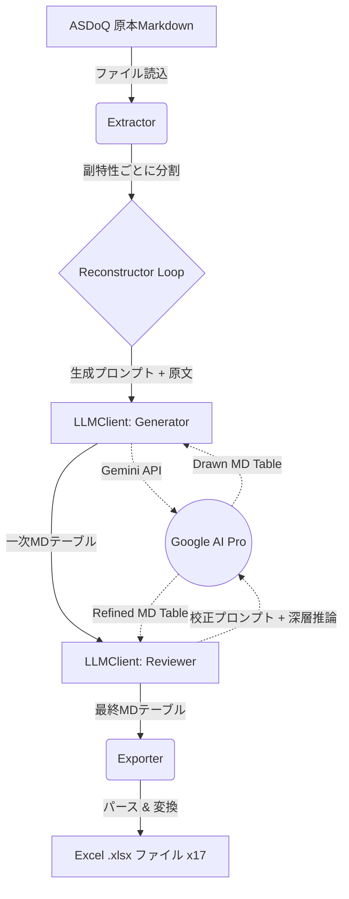

# SW205 ソフトウェアアーキテクチャ設計書 (Architecture Design)
**プロジェクト**: ASDoQ副特性再構成プログラム

## 1. 導入
### 1.1 目的
本書は、「SW105 ソフトウェア要求仕様書」で定義された要件（ASDoQ副特性のMarkdownファイルからの抽出、Gemini APIを利用した生成・校正のマルチエージェントパイプライン、Excelファイルへの出力）を実現するためのシステム全体構造とコンポーネント設計を定義する。

### 1.2 対象範囲
本設計書は、データの抽出からAPIの呼出シーケンス、ファイル出力のフォーマット変換といったバックエンド・データ処理のアーキテクチャについて記述する。

### 1.3 参照ドキュメント
- `doc/SW105_ソフトウェア要求仕様書.md`
- `doc/prompts/prompt_01_generator.md` (生成用プロンプト)
- `doc/prompts/prompt_02_reviewer.md` (校正用プロンプト)

---

## 2. システムアーキテクチャ

### 2.1 全体構成図
プログラムの処理フローは、以下の多段パイプライン構成とする。

### 2.2 技術スタック
- **言語**: Python 3.x
- **主要ライブラリ**:
  - `google-genai` (公式Gemini API SDK。モデル: gemini-3.1-pro-preview-customtools)
  - `openpyxl` - XLSXファイル生成および「メイリオ」フォント適用
  - `python-dotenv` - `.env` からのAPIキー読み込み用
  - `re` - 正規表現によるMarkdownテキスト抽出およびテーブルパース用

---

## 3. コンポーネント設計

### 3.1 Extractor (データ抽出モジュール)
- **役割**: 入力Markdownファイルを解析し、「品質副特性」の章を識別・分割してメモリ上に保持する。
- **検証条件**: 指定されたMarkdownを入力した際、戻り値が「17個の文字列リスト」となること。不足や過剰がある場合は例外（`ExtractionError`）をスローする。

### 3.2 LLMClient (API通信モジュール)
- **役割**: Gemini APIと通信し、指定されたシステムプロンプトと入力テキストを投げて応答を得る。
- **検証条件**: 応答文字列の先頭から末尾のいずれかに `|----` などのMarkdown Table構造が含まれていること。

### 3.3 Reconstructor (業務パイプライン・コントローラ)
- **役割**: Extractorから受け取った各テキストに対し、「Generator（深層推論含む）呼び出し」→「Reviewer（論理整合性校閲含む）呼び出し」を直列で実行する。
- **検証条件**: 第1フェーズ、第2フェーズの各応答結果が受け渡され、最終結果文字列の長さが0でないこと。

### 3.4 Exporter (出力変換モジュール)
- **役割**: LLMから返却された最終Markdownテーブルを解析し、ヘッダとレコードに分割。さらに `【改行】` 特殊文字列をExcelセル内改行（`\n`）に置換し、`.xlsx`形式で保存する。
- **検証条件**: 意図したファイル名 `(自動生成)特性名_副特性名_再構成.xlsx` がディスク上に生成され、Excel上で正しく開けること。

---

## 4. データアーキテクチャ

### 4.1 データモデル・ライフサイクル
1. **RawText**: Markdownファイルから読み込んだ1つの長い文字列。
2. **ChunkText**: `Extractor` が分割した、特定の副特性に関するセクション文字列。
3. **TableString**: LLMが生成・校正した、パイプ（`|`）で区切られたMarkdownテーブル表現の文字列。
4. **ParsedData**: `Exporter` がパースした、ListのList（例: `[["測定項目", "測定基準", ...], ["A", "B", ...]]`）。ここで『【改行】』を物理改行へ置換。

---

## 5. 非機能設計

### 5.1 APIのレートリミット対策・リトライ
- 17個の副特性に対してAPIを2回ずつ（合計34回）連続して呼び出すため、レートリミットに達する可能性がある。
- ループ間に1〜2秒程度のスリープ処理を導入する。
- APIから `429 Too Many Requests` や `500 Internal Server Error` などの一時的エラーが返った場合、指数バックオフ（Exponential Backoff）を用いて最大3回のリトライを行う。

### 5.2 エラーハンドリング（フォールバック方針）
- **パーサエラー**: MDテーブルの列数が合わない等のパース失敗時は、復旧不能としてエラーログを出力し、LLMが返した応答を生テキスト（`.log`）としてダンプして該当副特性の処理をスキップする。
- **API認証エラー**: 起動時の初回疎通確認で失敗した場合は即座にプログラムを異常終了（Exit）し、無駄な呼び出しを防ぐ。
